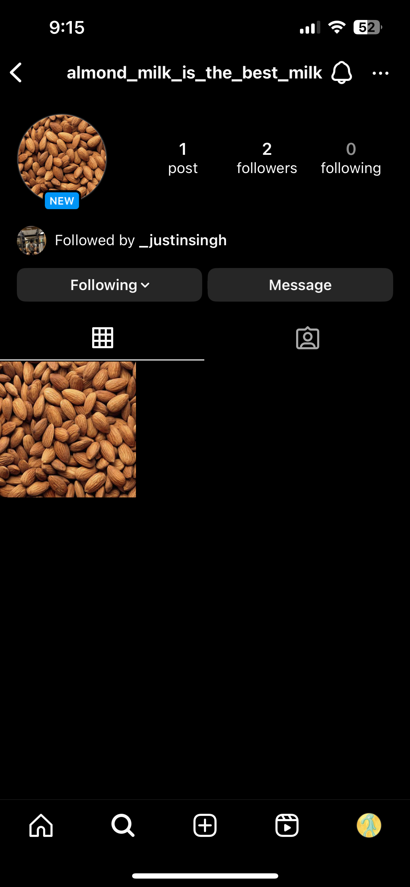
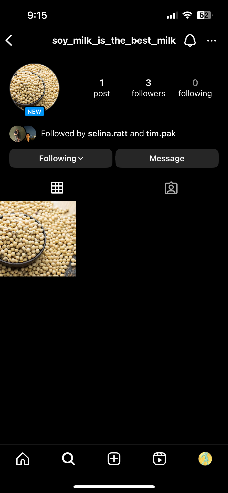
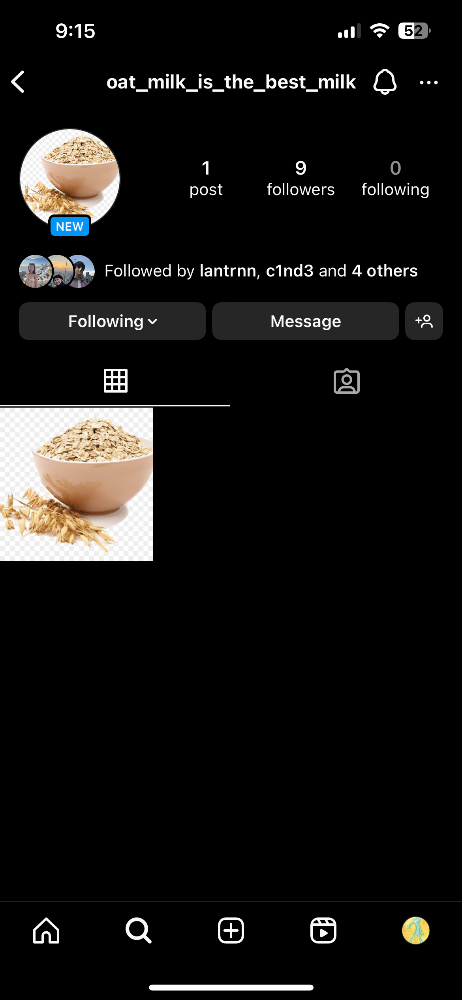
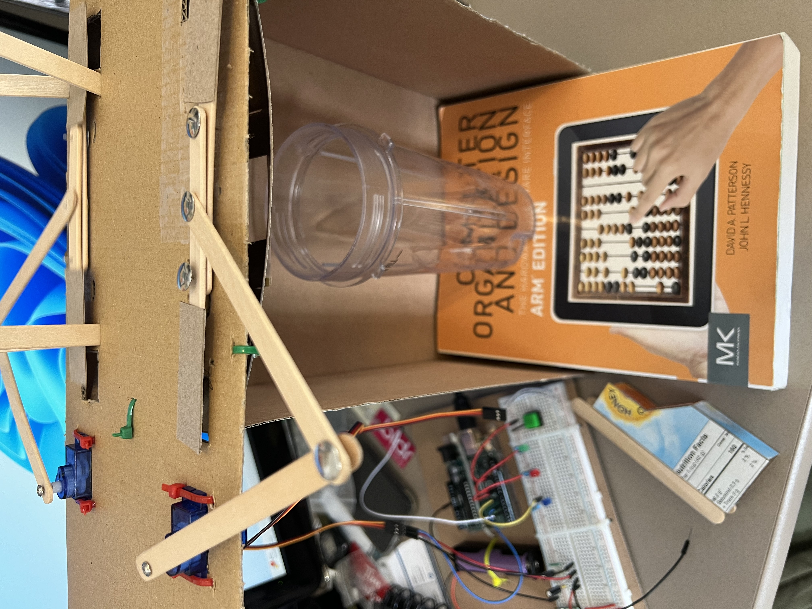
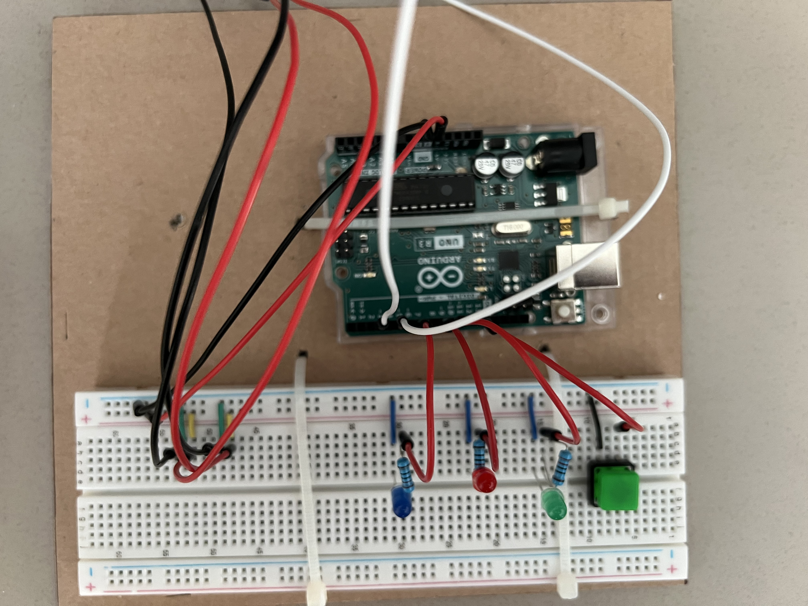
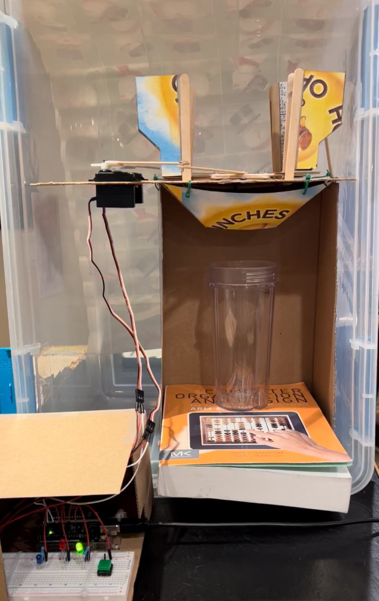

# milk-maker

## Concept
What is the best kind of milk? It is an age old question. Some people might say cow, others almond, or maybe soy. But what if you didn't have to choose just one milk, that is what milk maker is for. Milk maker is a way for people to come together to decide who likes which milk and to create a new, unique milk that represents everyone's milk preference. 

Milk maker creates milk by checking instagram for people's milk preference and then dispensing each milk ingredient into a blender container based on the data milk maker collects. In particular, each milk type has a dedicated instagram page that people can follow, where each follower for a milk page represents a vote for that milk. This means that you technically vote for more than one milk by following more pages, which helps users who can't choose just one favorite milk. In the current version of milk maker, instagram pages has been setup for soy, oat, almond, and coconut milk (a screenshot from each page is provided below). Originally I intended for user voting to take place on twitter, where users could vote on a twitter poll that milk maker could then collect the results from. However, the new version of twitter API (updated in late 2023) has heavily restricted the free access so I could not retrieve poll results without paying for the premium version. The current milk selection was choosen as they each coome from some dry ingredient (ie oat milk comes from dry oats). This made creating a dispenser for each inegredient easier to create as I didn't have to deal with any liquid component (which was very handy as my interface was made out of cardboard).

For more information of how to build and run the project, check the circuit schema below and the functionality section.

## Circuit Schema

## Instagram pages

## Photos

## Video Explanation and Demo

[Video](https://youtu.be/yMld8e0tEiU)

## Functionality
The components for this project are
- an Arduino
- 2 servos
- 3 LEDs
- 3 220 ohm resistors
- 1 push button
- wires
- a lot of cardboard and popsicle sticks
- milk ingredients

To run the code, import the Arduino code onto your Arduino, and then begin running the python code.

The dispenser is operated by a slider crank machanism that is powered by a servo. The servo will open a funnel full of a milk's dry ingredient for a set amount of time that is based of that milk's follower count. All of the ingredients will then fall into a blender container which a user can then use to blender and sweeten the milk to their liking (rough recipe for milk below). Since there are only instagram pages for soy, oat, almond, and coconut milk, the dispensers should be filled accordingly with these ingredients. The layout of the dispensers is the front right is soy, front left is oat, back left is almond, and back right is coconut. One issue I found with my dispenser design is that the servos are not always poerful enough to properly open and close each dispenser. When testing the interface try to run the dispenser without any ingredients (ie no weight) to see the mechanism work as intended and then add ingredients after. In the future I would try to use a stronger servo for the slider crank or use a different mechanism the operate the opening and closing acctuation. 

## Recipe
This recipe is for approximately 1 cup of milk
### Ingredients
- 1/3 - 1/2cup dry ingredients
- 1 cup water
- 1tsp - 1tbsp sweetener (I used maple syrup)
- pinch of salt
### Steps
- place ingredients in a blender
- blend til smooth
- strain into a glass
- enjoy

## References
### Tutorials Used for the Project
- Arduino serial read data to integer. (2020). YouTube. Retrieved March 8, 2024, from https://www.youtube.com/watch?v=pG-GF9yCA5c.
- Arduino. (2024, March 11). Servo Motor Basics with Arduino. Arduino Docs. March 4, 2024, https://docs.arduino.cc/learn/electronics/servo-motors/
- bxparks. (2024, February 28). AceButton. GitHub. March 4, 2024, https://github.com/bxparks/AceButton
- Control Arduino using Python. (2023). YouTube. Retrieved March 7, 2024, from https://www.youtube.com/watch?v=na8ksdfN0KM&list=PLdhbjaVF7HRVGKCVtEAFzrGCVN8om3kJU&index=8.
- get Instagram account information with python. (2022a). YouTube. Retrieved March 7, 2024, from https://www.youtube.com/watch?v=E6wgokYYrUo.
- Python serial port communication using PySerial. (2022b). YouTube. Retrieved March 7, 2024, from https://www.youtube.com/watch?v=Kr1RyK6WENQ. 

### Image Sources from Instagram Pages and Video
- Hackett, J. (2019). Soy Beans. The Spruce Eats. Retrieved March 8, 2024, from https://www.thespruceeats.com/how-to-cook-soy-beans-3376401.
- Mulcahy, L. (2023). Coconuts. Good Housekeeping. Retrieved March 8, 2024, from https://www.goodhousekeeping.com/health/diet-nutrition/a45965113/coconut-nutrition-benefits/.
- Sass, C. (2023). Almonds. Health. Retrieved March 8, 2024, from https://www.health.com/food/health-benefits-almonds.
- Shivegami. (n.d.). Wheat cartoon. Clear PNG. Retrieved March 8, 2024, from https://www.cleanpng.com/png-porridge-rolled-oats-stock-photography-oatmeal-2098321/. 
